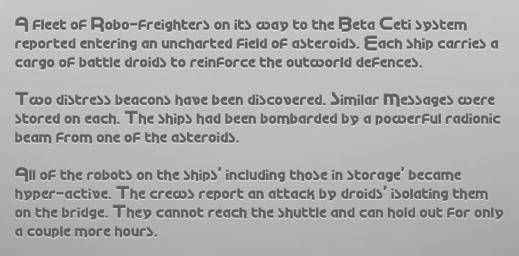

Paradrew Font
======

**Paradrew Font** is a font family based on the fonts viewed in the Commodore 64 computer game [Paradroid](//en.wikipedia.org/wiki/Paradroid)
written by [Andrew Braybrook](//en.wikipedia.org/wiki/Andrew_Braybrook).
Paradroid was published in 1985 and was considered by many, one of the trailblazer of its genre and time.
The name of this font is a merge of "_Paradroid_" and the first name of its creator "_Andrew_ Braybrook".

The font is vectorized based upon screenshots of the original bitmaps and best efforts
were given to honor the original font - some divergence were done to adhere typographical guidelines.

## License

This work is licensed under a
[Creative Commons Attribution 4.0 International](#cc-attribution-40-international).

[![CC BY 4.0][cc-by-shield]][cc-by]

[cc-by]: http://creativecommons.org/licenses/by/4.0/
[cc-by-image]: https://i.creativecommons.org/l/by/4.0/88x31.png
[cc-by-shield]: https://img.shields.io/badge/License-CC%20BY%204.0-lightgrey.svg

## Preview

